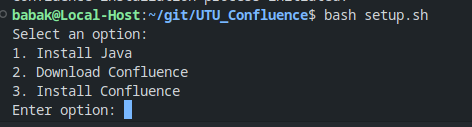

# Confluence Installation Script

This repository contains a Bash script for automating the installation of Confluence on Ubuntu systems.

## Features

- **Java Installation**: Automatically installs Java, which is a prerequisite for running Confluence.
- **Confluence Download**: Downloads the Confluence installation file directly from the Atlassian website.
- **Confluence Installation**: Installs Confluence using the downloaded file.

## Usage

1. Clone this repository or download the script.
2. Give execute permission to the script: `chmod +x install_confluence.sh`.
3. Run the script: `./install_confluence.sh`.
4. Choose an option from the menu:
   - `1` to install Java.
   - `2` to download Confluence.
   - `3` to install Confluence.
   - `0` to exit the script.

## Requirements

- Ubuntu-based Linux distribution.
- Internet connection for downloading Java and Confluence.
- Sudo privileges for installation.

For more details, refer to the official Confluence installation guide from Atlassian.

## Contributions

Contributions to this script are welcome. Please submit issues and pull requests as needed.

## License

This script is distributed under the MIT License. See `LICENSE` for more information.
